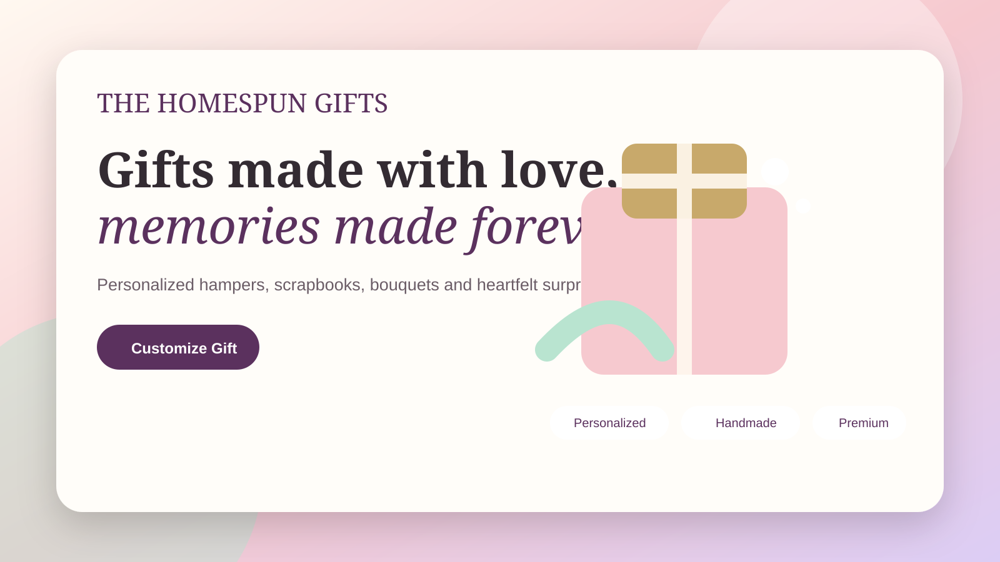

<div align="center">

# 🎁 The Homespun Gifts

### Premium Personalized Gifting Experience

Beautifully crafted hampers, scrapbooks, bouquets and personalized gifts — built as a premium, responsive and interactive shopping experience.

<br />

<a href="https://satitech-official.github.io/the-homespun-gifts-premium-website/">
  
</a>

<br /><br />

[](https://satitech-official.github.io/the-homespun-gifts-premium-website/)

</div>

## ✨ Highlights

- Premium responsive gifting storefront
- Personalized hampers and gift experiences
- Interactive product cards and smooth animations
- Shop, wishlist, cart and product-detail flows
- Luxury pastel visual system
- Mobile-friendly layouts
- GitHub Pages optimized static deployment

## 🚀 Live Website

**Live Demo:** https://satitech-official.github.io/the-homespun-gifts-premium-website/

## 🛠️ Tech Stack

Next.js 16 • React 19 • Tailwind CSS • Framer Motion • Zustand • Lucide React

## 💻 Run Locally

```bash
npm install
npm run dev
```

Then open `http://localhost:3000`.

---

<div align="center">
  Made with ❤️ for <strong>The Homespun Gifts</strong>
</div>
